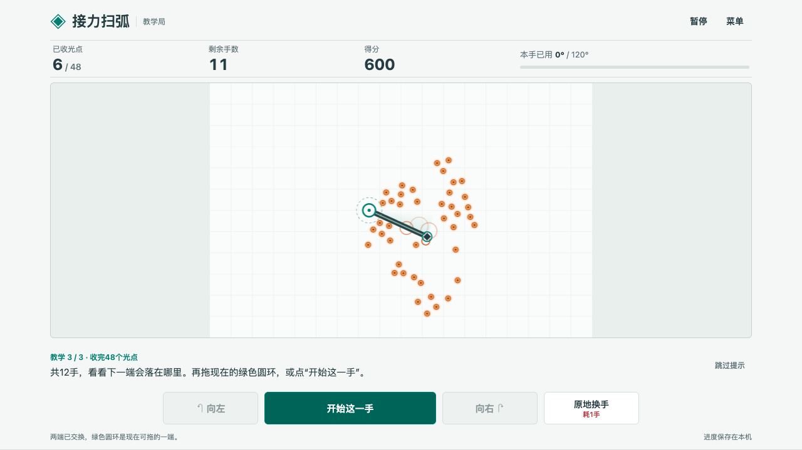
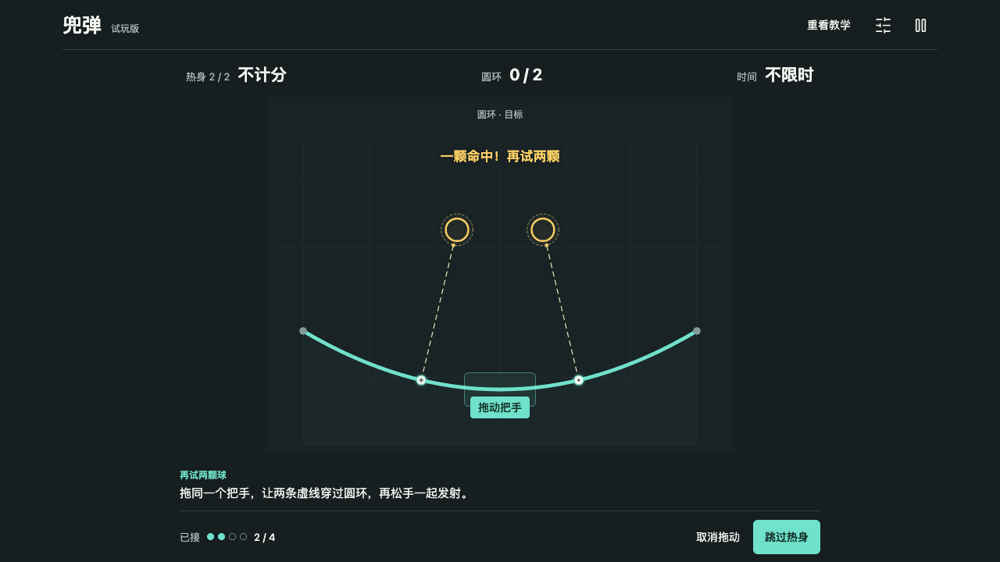
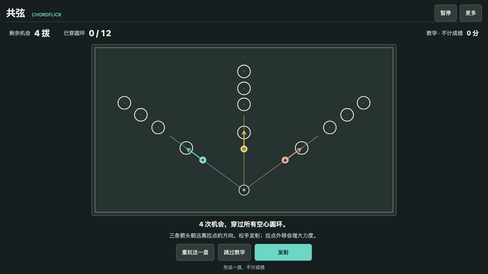

# 游戏 Demo 集

收录作者选入的游戏原型，目前包含 1902–1912 共 11 款，支持在线试玩和离线下载。

[合集试玩](https://zjfll.github.io/game-demos/) · [接力扫弧](https://zjfll.github.io/game-demos/games/1902/) · [兜弹](https://zjfll.github.io/game-demos/games/1903/) · [共弦](https://zjfll.github.io/game-demos/games/1904/)

## 接力扫弧 · 1902

转动扫杆收光点，松手换到另一端。每次停在哪里，都决定下一手从哪里扫。

- 目标：12 手内收完 48 个光点，每个光点 100 分。
- 操作：拖动绿色圆环，松手结束这一手；也可使用画面中的转向按钮。
- 每手最多转 120°，来回转都计入用量。
- 支持电脑、手机；首次进入有教学提示，同局面可以重试。
- 游戏进度仅保存在当前浏览器，不上传游戏数据。

## 兜弹 · 1903

弹带接住落下的球，拖动同一个把手改变几条球路，松手一起发射。

- 同时最多接 4 颗球；一发命中更多圆环，分数更高。
- 包含一球、两球热身，90 秒标准局及不限时练习。
- 鼠标、键盘和触摸可操作；重试保留目标及来球顺序。
- [在线试玩](https://zjfll.github.io/game-demos/games/1903/) · [离线包](downloads/curve-volley-1903.zip)

## 共弦 · 1904

三颗珠共用一个拉点，朝各自远离拉点的方向弹出。每拨停在哪里，会影响下一拨。

- 4 次机会穿过 12 个空心圆环；墙和实心圆会反弹。
- 六个固定盘面，包含基础、借墙、交叉和留位。
- 鼠标、键盘和触摸可操作；同盘重试保留初始布局。
- [在线试玩](https://zjfll.github.io/game-demos/games/1904/) · [离线包](downloads/chordflick-1904.zip)

## 1905–1912

| 编号 | 游戏 | 核心玩法 | 试玩 / 下载 |
| --- | --- | --- | --- |
| 1905 | 兜弹 · Scoop & Snap | 兜住同形粒子，拉紧队形，再把整束送向对应收口。每一颗的位置都影响这一束能否全中。 | [在线试玩](https://zjfll.github.io/game-demos/games/1905/) · [离线版](downloads/scoop-snap-1905.zip) |
| 1906 | 兜弦 · 接住 · 拉开 · 齐放 | 用两段弦接住落下的光片，移动把手调整整袋落点，再松手齐放进槽。 | [在线试玩](https://zjfll.github.io/game-demos/games/1906/) · [离线版](downloads/douxian-1906.zip) |
| 1907 | 换轴破阵 · Pivot Break | 绕固定端摆动长杆，换轴改变立足点。用活动端撞开封锁，再把整根杆送进出口。 | [在线试玩](https://zjfll.github.io/game-demos/games/1907/) · [离线版](downloads/pivot-break-1907.zip) |
| 1908 | 折流 · TURNLINE | 立锚后侧移拉出短线，把冲来的物件反射进槽。线只能用一次，出手时机和角度都要刚好。 | [在线试玩](https://zjfll.github.io/game-demos/games/1908/) · [离线版](downloads/turnline-1908.zip) |
| 1909 | 借流 · JL-D0.1 | 自由立锚拉线，接住圆弹再导向边界出口。只有真正进入收口，才算送达。 | [在线试玩](https://zjfll.github.io/game-demos/games/1909/) · [离线版](downloads/jieliu-1909.zip) |
| 1910 | 绷线 · BENGXIAN | 拉线接住圆弹，把危险变成暂存货物。松手回到锚点才入账，带得越多越要把握回收时机。 | [在线试玩](https://zjfll.github.io/game-demos/games/1910/) · [离线版](downloads/bengxian-1910.zip) |
| 1911 | 借流 · SLIPLINE | 从亮起的港口接线，边移动边把圆弹转成流动的小珠。守住运输路线，将六座港口逐一送满。 | [在线试玩](https://zjfll.github.io/game-demos/games/1911/) · [离线版](downloads/slipline-1911.zip) |
| 1912 | 牵流 · D0.1 | 牵线截住圆珠，再从身体端导向收口。松手留下旧轨排空，边换位边躲开自己放出的圆珠。 | [在线试玩](https://zjfll.github.io/game-demos/games/1912/) · [离线版](downloads/qianliu-1912.zip) |

每款游戏均有教学或练习入口，具体操作见游戏内说明和各目录 README。1905 的《兜弹》采用同形收束发射；1909 的《借流》采用自由锚点与边界收口，1911 的《借流 / SLIPLINE》采用固定港口运输。

## 离线试玩

下载各游戏的离线包，解压后打开对应编号文件夹内的 `index.html`：[1902](downloads/sweep-relay-1902.zip)、[1903](downloads/curve-volley-1903.zip)、[1904](downloads/chordflick-1904.zip)。也可下载本仓库，打开首页 `index.html`。无需安装或构建。

游戏数据仅保存在当前浏览器，不自动上传。游戏原型已有规则及浏览器检查，真实新人理解和趣味性仍待试玩反馈。

- [1905《兜弹》](downloads/scoop-snap-1905.zip)
- [1906《兜弦》](downloads/douxian-1906.zip)
- [1907《换轴破阵》](downloads/pivot-break-1907.zip)
- [1908《折流》](downloads/turnline-1908.zip)
- [1909《借流》](downloads/jieliu-1909.zip)
- [1910《绷线》](downloads/bengxian-1910.zip)
- [1911《借流》](downloads/slipline-1911.zip)
- [1912《牵流》](downloads/qianliu-1912.zip)

## 目录与发布

- `index.html`、`gallery.css`：合集首页。
- `games/1902/` 至 `games/1912/`：各游戏运行文件与简要说明。
- `assets/`：实机截图。
- `downloads/`：离线试玩包。

GitHub Pages 从 `main` 分支的根目录发布。添加游戏时，将运行文件放入独立的 `games/<编号>/` 目录，在首页增加对应条目，并更新此说明。只收录运行文件、必要素材和说明；原始会话、研究归档、账号信息不放入仓库。

## 使用范围

本仓库公开供试玩与查看源码，尚未授予通用开源许可证。如需将代码或素材用于其他项目，请先联系仓库作者确认。

游戏画面由程序绘制，音效由 Web Audio 合成，字体使用设备系统字体；运行时不加载远程素材或服务。1903《兜弹》使用的 Lucide 工具栏图标许可见 [NOTICE.txt](games/1903/NOTICE.txt)；该许可仅覆盖所列第三方图标，不代表整个仓库采用同一许可证。
